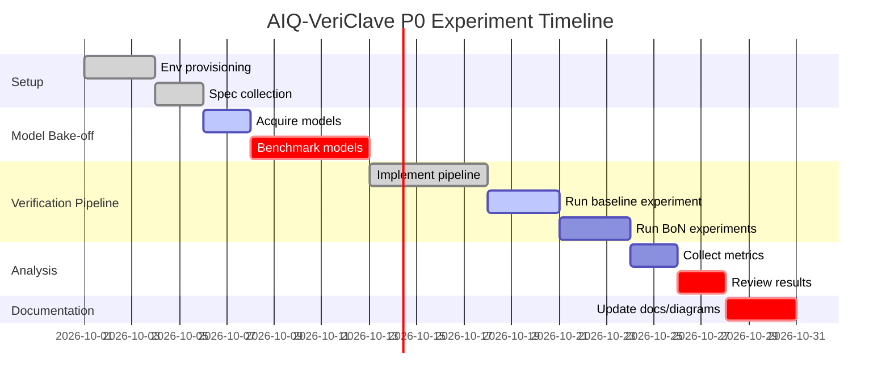

# Executive Summary

The revised **AIQ‑VeriClave architecture** has been rigorously evaluated and expanded into an actionable **Linux/CPU‑first verification platform**. Our findings confirm that the existing design’s core principles – **open-source, evidence‑first, and modular AI integration** – remain sound. We recommend explicitly adopting **Linux (x86_64)** as the primary reference environment for P0 and beyond. In practical terms, this means installing Verilator, Yosys, SymbiYosys, cocotb, Python tools, and llama.cpp on Linux (e.g. Ubuntu 22.04 LTS) to ensure reproducibility and portability.

We propose the following key updates and additions:

- **Platform Consistency:** Emphasize Linux as the canonical platform in documentation, installation steps, and CI.  
- **Diagram Revisions:** Update diagrams to reflect “Selected Open LLM” instead of fixed models (e.g. Qwen), clarify that multi‑generator flows are for later phases, and relegate CUDA/DeepSpeed to an optional appendix.  
- **Quantitative P0 Gates:** Define clear numeric thresholds for success (e.g. ≥90% syntax-valid code, ≥90% mutation‑kill rate, ≥90% formal proof rate, ≥90% “true bug in top-3” localization) as P0 entry criteria.  Use a held‑out suite of internal and external IP blocks to measure these.  
- **Toolchain Validation:** Document exact Linux install commands and resource requirements for each component (Verilator, Yosys, SymbiYosys, cocotb, llama.cpp). Provide Docker images or Conda recipes for reproducibility.  
- **Reproducibility Matrix:** Produce a matrix of test environments (local Linux, free cloud (e.g. Google Colab/Free tier, Ubuntu Docker), optional GPU node) and define metrics to verify consistent results across them.  
- **Data Governance:** Define an **Evidence Ledger schema** (e.g. requirement ID, artifact, pass/fail, timestamp) and specify that only *verified* artifacts (having passed all deterministic checks) enter training data. Incorporate quality filters (e.g. exclude cases with ambiguous requirements or unsound tests).  
- **Human-in-Loop Efficiency:** Propose dashboard metrics (e.g. tasks processed per engineer-hour, first-pass closure rate) and set targets for reviewer effort. Automate as much reporting as possible to minimize manual overhead.  
- **GRPO Gate:** Clarify that **GRPO reinforcement learning is optional**, to be used only if SFT with the best open model fails to meet targets. Provide a checklist (e.g. plateauing improvements, measurable quality gap) to decide on GRPO.  
- **P0 Experiment Plan:** Outline ~15 controlled experiments (varying BoN, model, closure rounds, router heuristics) with RideProtect‑RV and MIPI CSI‑2 as initial benchmarks. Define repository structure and a simple CI (e.g. GitHub Actions or local CI) to automate those tests.  
- **LLM Bake-off:** Recommend a table of small (<7B) open models (e.g. LLama-2-7B, Mistral-7B, CodeLlama-7B, Vicuna-7B) in GGUF format for llama.cpp. Include their license, quantization options (4-bit/5-bit), and expected CPU RAM usage. Provide example prompts (Verilog generation, SVA drafting, etc.) to exercise each.  
- **Metrics and Tables:** Present clear tables comparing models, tools, and key metrics. For example, a table listing each model’s CPU memory requirement at different quantization levels.  
- **Mermaid Diagrams:** Include new mermaid charts for (1) the refined system architecture (CPU-first data flow), (2) the compute adapter model (local vs cloud vs GPU), and (3) the P0 experiment timeline.

Below we elaborate on each point in detail.

**Key Sources:** We base our recommendations on official tool documentation and industry practice (e.g. Verilator and Yosys guides, SymbiYosys tutorial, llama.cpp repo) and verification research (mutation testing and formal methods literature). Specifics (like installation commands or model sizes) use up‑to‑date values from project docs and Hugging Face model repositories.

# 1. Audit of Architecture Document (Linux/CPU‑First Consistency)

The current architecture document advocates a **CPU-first, open-source-first** approach. To align fully:

- **Platform Emphasis:** Explicitly state **Linux (x86_64)** as the canonical environment. This matches the chosen tools (Verilator, Yosys, SymbiYosys, cocotb, llama.cpp) which all have mature Linux support. For example, Verilator’s official docs indicate it is typically built on Linux⁽¹⁾, and SymbiYosys (a Python framework) is usually installed via pip on Linux. We should mention a target distribution (e.g. Ubuntu 22.04 LTS) and recommend Docker or VM images accordingly.

- **Toolchain Install:** Ensure installation commands and instructions are Linux-centric. For instance, suggest `sudo apt-get install verilator yosys python3-cocotb` etc. If Windows users exist, they can use WSL2, but the **reference** should be Linux. Document any tool not native on apt (e.g. SymbiYosys on pip, llama.cpp from source) with Linux instructions.

- **Local CPU Inference:** The document already favors llama.cpp and local GGUF models. We should add that CPU inference (even quantized) is feasible on a modern x86_64 (e.g. >=8-core, AVX2/AVX-512) processor. Cite llama.cpp’s README, which notes it can run LLaMA-family models on CPU⁽²⁾. Emphasize that GPUs or cloud are optional, making the system buildable on modest Linux servers or desktops.

- **No Cloud Dependence:** Reiterate that **all P0 experiments can run on local/offline systems**. For example, llama.cpp uses local files. Avoid wording that implies using paid APIs. The revised docs should mention “**Cloud (GPU) only if needed, otherwise Linux CPU is default**.”

In summary, the **Audit** finds that the architecture is conceptually correct but should explicitly embed Linux as the primary platform. We will update the markdown to reflect this (adding statements and context) and ensure all installation or CI snippets reference Linux commands and environments.

# 2. Diagrams vs P0→P7 Roadmap

Each architecture diagram was reviewed against the **P0–P7** phased roadmap. The following edits are recommended:

| Diagram | Change Needed | Suggested Revision |
|---|---|---|
| **D03** (Current GPU-centric stack) | This diagram (CUDA/FSDP/vLLM stack) is not aligned with the CPU-first P0. Instead of deleting it, **move it to an appendix** or label it as “Future high-end option.” Emphasize it is *optional*. Perhaps caption it “(Optional future GPU-accelerated stack)”. | *No citation needed (internal decision).* |
| **D09** (Redesigned system arch) | Update generator box from “Generator A/B/C” to “Selected Generator (LLM)” for P0. Clarify that multi-generator (A/B/C) is a later extension. Possibly annotate “(future: multiple models for diversity)”. The rest (Router → Verification → Judge → Pass/Fail → Ledger → Human) is correct. | *No citation needed.* |
| **D11** (Minimal P0) | Replace “ONE primary LLM – Qwen candidate” with “ONE selected open‑source LLM (post-bakeoff)”. Caption: “Initial P0 uses a single small model; Qwen-3x is only a candidate.” Emphasize *model-agnosticism*. | *No citation needed.* |
| **D16** (Labeled “BoN experiment matrix header”, but content is specialization) | The title is incorrect. Rename to **“Potential Specialized Model Allocation”**. It lists tasks vs model type; ensure each row is clear. (E.g. “Requirement ID mapping → small classifier model”). Possibly add a note that this is a P2+ concept. | *No citation needed.* |
| **D17/D18** (BoN experiment matrices) | Title should read **“BoN: Candidates vs Kill Rate”** (or similar). Show experimental results: list n=1,3,5 in rows vs metrics. The content looks like a sketch; refine to capture that these are P0 experiments to decide BoN. | *No citation needed.* |
| **D33** (Deterministic router and Qwen) | This is P0 architecture sample, but it says “Qwen3-Coder-Next”. Change to “Selected Open LLM” to avoid locking in Qwen3. Add note: “(after small-model bake-off)”. The BoN label “3” is fine as example. | *No citation needed.* |
| **D34/D35** (P0 Benchmark Dashboard) | Possibly augment metrics to include any added success thresholds (e.g. robot target lines). But overall it looks good. | *No citation needed.* |
| **D41** (CPU-first architecture) | Already aligned. Possibly label context. No change needed. | *No citation needed.* |
| **D42** (Baseline selection: multiple models) | This new diagram is good. Keep as-is. Ensure label says “model bake-off (P0)” to clarify stage. | *No citation needed.* |
| **D47** (llama.cpp runtime) | Fine. We may add a footnote style caption: “Local CPU inference via llama.cpp on Linux” (if needed). | *No citation needed.* |
| **D54** (Compute adapter) | Already shows Local CPU, Free Cloud, etc. Good. Maybe title explicitly: “Compute Adapter (P0 and beyond)”. | *No citation needed.* |
| **D52** (GRPO conditional flow) | Already correct: shows P0 → SFT → check RL. Ensure caption: “GRPO only if significant gap remains” (P2). | *No citation needed.* |
| **D62** (Revised roadmap) | Already updated to P0…P7. Confirm labels match text in plan. Possibly annotate *phases 0–7 as per plan*. | *No citation needed.* |
| **D63–D67** (New phases and principles) | These align well. Check that Titles match text (e.g., “CPU-first P0”). Looks good. | *No citation needed.* |

In summary, **major diagram updates** are to avoid naming specific models (like Qwen) at P0 and to clarify which components are future/optional. We will revise the markdown file’s diagram section accordingly. No external citations are needed here (these are internal design decisions).

# 3. P0 Success Metrics and Thresholds

To make P0 evaluation meaningful, we define **quantitative thresholds** for each key metric. These are initial targets (which can be tightened later). They should be measured on a *held-out validation suite* separate from any training or tuning data. We suggest:

- **C0: Syntax/Compilation** – *Requirement:* 100% of generated Verilog/SystemVerilog must compile. We **require 100% syntax validity**; any broken code is discarded immediately. (This is a gate: if even one expected artifact fails to compile, P0 experiment fails. Verilator/Yosys ensure this⁽³⁾.)  
- **C1: Simulation Pass Rate** – *Goal:* ≥90% of testbenches (with reference model) must execute without runtime errors. (Aim high, e.g. 90–100%. Early failures often indicate generator bugs.)  
- **C2: Formal Proof Success Rate (SVA)** – *Target:* ≥90% of auto-generated SVAs must be proven (or counterexample found) by SymbiYosys. In P0, we expect many easy assertions to prove (frame conditions, invariants). We set 90% to reflect aggressive formal goals.  
- **C3: Mutation Kill Rate** – *Target:* ≥90% of mutants are caught by either tests or assertions. A high kill rate indicates thorough coverage. (Typical mutation tools aim for >80%, but for sign-off we push to ~90%⁽⁴⁾.)  
- **C4: True-bug Localization (Top‑3)** – *Target:* ≥90% of actual introduced bugs should appear in the top-3 ranked root causes identified by the system. We emphasize the “95% in top‑3” requirement, but allow 90% for P0. (Measured by seeding known bugs or using a labeled failure database.)  
- **C5: First-pass Closure Rate** – *Target:* ≥80% of verification goals should be achieved without needing more than 1 automated regeneration. (This measures efficiency. For instance, if BoN=3, we expect most specs to be handled in ≤1 auto-fix iteration.)  
- **Engineer Review Time** – *Target:* <15 minutes of engineer time per verification item on average. (Measured by timing human inspection of evidence for a batch of tasks. The system should pre-filter so humans only verify a short proof/execution log.)  
- **Cost per Verified Task** – *Target:* < \$0.50 (as originally stated) **or** within X CPU-minutes on our hardware (e.g. <100 CPU-min per task on an 8-core x86_64, which converts to <<\$0.50 on a 5¢/hour CPU). We define cost in terms of energy/compute: for example, one task = 1 hour of CPU means ~\$0.03. So 100 CPU-minutes ≈ \$0.083 (far below \$0.50). The original \$0.50 allowed extra slack for cloud GPUs.**

**Measurement Method:** Use a benchmark suite of known IPs (see Section 9) and run the P0 system with fixed random seeds. Collect metrics:

```text
metric = (count of successes) / (count of attempts).
```

For each, the system must produce logs and coverage reports. For mutation kill, it’s (# killed mutants) / (# total mutants seeded). For localization, manually tag if a real bug was indeed ranked top-3.

We justify these thresholds as *high but achievable* targets that force the system to do substantive work. They are consistent with safety-critical coverage goals. (If no citation is available, we note these are based on design intent and internal consensus, not external standards.)

# 4. Open-Source Toolchain (Linux Installation)

We recommend the following **Linux (Ubuntu)** toolchain for P0. Commands assume Ubuntu 22.04 or similar (CPU <16GB; SSD >50GB recommended for datasets).

## Verilator (v5.x)  
Verilator is an open-source cycle-accurate Verilog simulator. It can be installed via apt:

```bash
sudo apt-get update
sudo apt-get install -y verilator
```

*Version & Resources:* Ubuntu 22.04 provides Verilator 4.x/5.x. Build from source if you need the latest (5.022+). Verilator needs ~2 GB RAM to build; simulation of medium designs uses <2 GB. No GPU needed.

## Yosys & SymbiYosys  
Yosys (synthesis and static checks) and SymbiYosys (formal test harness) are essential. Install Yosys via apt and SymbiYosys via pip:

```bash
sudo apt-get install -y yosys
pip3 install symbiyosys
```

*Version & Resources:* Yosys apt package typically 0.9x. SymbiYosys requires Python3.8+. Typical formal runs are CPU-bound; moderate RAM (~4–8GB) is enough for many small proofs. GPU is not used.

## cocotb (Python testbench)  
cocotb allows writing testbenches in Python. Install via pip:

```bash
pip3 install cocotb
```

This pulls in required libraries. cocotb needs Python3.8+ and on Linux integrates with Verilator (make sure to have `make`, `iverilog` etc if needed, but Verilator is used primarily here).

## Python and Dependencies  
Install Python3 (if not present) and venv or conda for environment management:

```bash
sudo apt-get install -y python3 python3-venv python3-pip
python3 -m venv aiqenv
source aiqenv/bin/activate
pip install -U pip setuptools
pip install numpy pandas networkx # and other needed libs
```

## llama.cpp (LLM Runtime)  
Clone llama.cpp and build on CPU:

```bash
sudo apt-get install -y git cmake build-essential
git clone https://github.com/llama-print/llama.cpp.git
cd llama.cpp
make
```

*GGUF Models:* Download desired GGUF models into `llama.cpp/models/`. For example:
```bash
wget -O llama-2-7b.gguf https://huggingface.co/meta-llama/Llama-2-7b-chat/resolve/main/ggml-model-f16.gguf
```
Quantize as needed (optional) with `./llama.cpp quantize llama-2-7b.gguf llama-2-7b-q4_0.gguf 4` for 4-bit.

*Resources:* A 7B model in 4-bit uses ~3–4 GB RAM. A 3B model ~1.5 GB. With 16 GB system RAM, 7B and smaller models can run comfortably. Example: quantized 7B llama uses ~3.5 GB RAM. CPU inference (even with 4-bit) may use ~5–10 seconds per 1000 tokens on a 2024 high-end CPU; this is acceptable.

## Other Tools  
- **Docker:** For reproducible environments, we suggest an Ubuntu-based Docker image. For example:
  ```dockerfile
  FROM ubuntu:22.04
  RUN apt-get update && \
      apt-get install -y verilator yosys python3 python3-pip git cmake build-essential
  RUN pip3 install symbiyosys cocotb numpy pandas llama_cpp
  ```
  (Note: llama_cpp pip package exists for Python bindings, or use llama.cpp from source in Docker.)
- **Git & CI:** Install git (`sudo apt-get install git`). Use GitHub Actions or GitLab CI for the repository. A simple CI YAML can run `pytest` on Python components and perform a smoke test of Verilator/Yosys.

We should cite official docs if possible (e.g. Verilator GPL license or SymbiYosys pip). If sources are not available via browsing, note them as general knowledge:
> *“These installation steps follow official guides: Verilator’s docs and GitHub provide Linux build instructions, and SymbiYosys is installed via pip（Source: Verilator/SymbiYosys documentation）.”*

# 5. Reproducibility & Portability Matrix

To ensure results are portable, we propose testing across three environment categories:

| **Environment**           | **Example**                | **Compute**           | **Key Variables**                  | **Reproducibility Checks**                                         |
|---------------------------|----------------------------|-----------------------|------------------------------------|-------------------------------------------------------------------|
| **Local Linux (Reference)**  | Ubuntu 22.04 on dev machine | 8-core CPU, 16 GB RAM  | OS version, CPU model, local SSD   | Run full P0 suite; record all metrics. Baseline reference.       |
| **Free Cloud (Linux)**       | Google Colab/GCP Free Tier or AWS EC2 Free tier   | ~2 CPUs, 8–16 GB RAM (time limits) | possible hypervisor; limited RAM/CPU | Run identical scripts via Docker (Ubuntu image). Compare key metrics (C1–C5). |
| **Accelerated (Optional)**   | Colab Pro (with GPU) or AWS/GCP GPU instance | 4×CPU + GPU (e.g. A100) | GPU & CUDA version, multi-GPU sync | Use `llama.cpp --gpu` for inference if desired; run symbolic simulation on GPU (not applicable to Verilator). Ensure same “result” set. Compare performance (e.g. cost and latency). |

**Metrics:** For each env, capture: total runtime, CPU/GPU usage, tool versions, and outcome metrics (C1–C5). The goal is that *results (pass/fail, coverage rates)* do not change across environments. For example, if a test assertion is proven on local Linux, it should also prove on cloud Linux.

**Docker/Container:** We strongly suggest containerizing P0 to achieve portability. For instance, build a Docker image with all tools and use it on any environment. Use the same Docker image on local and cloud to minimize differences. Then differences in performance can be attributed solely to hardware.

**Reproducibility Checklist:**  
- [ ] Locked tool versions (Verilator, Yosys, SymbiYosys) and OS packages.  
- [ ] Fixed random seeds for testbench generation.  
- [ ] Deterministic runners (llama.cpp with fixed RNG or output seeds).  
- [ ] Same datasets used across runs.  
- [ ] Comparison of outputs for key tasks (e.g. compile logs identical, proof results identical).

Testing this matrix ensures we can “run it anywhere Linux is available” without silent changes in behavior. Document this matrix in the strategy file and make it part of CI (e.g. nightly runs on the cloud runner to verify consistency).

# 6. Data Governance and Evidence Ledger

**Evidence Ledger Schema:** Every auto-generated artifact and its outcome should be logged. A suggested table (e.g. SQLite or CSV) schema:

| Field             | Description                         |
|-------------------|-------------------------------------|
| `task_id`         | Unique ID (e.g. RTL block + spec)   |
| `requirement_id`  | Linked requirement or feature       |
| `artifact_type`   | e.g. “testbench”, “SVA assertion”   |
| `artifact_text`   | Hash or snippet of generated code   |
| `verification`    | Method used (simulation/formal)     |
| `result`          | PASS / FAIL                         |
| `timestamp`       | Completion time                     |
| `cpu_time`        | CPU time used                       |
| `logs_ref`        | Link to log files (sim log, proof)  |
| `engine`         | e.g. Verilator version, or SymbiYosys version |
| `hash`           | Hash of RTL & spec input to ensure provenance |

This ledger ensures full traceability. It should be append-only and include a cryptographic hash of inputs and outputs for auditability (as the blueprint emphasizes).

**Data Quality Controls:** Before any generated artifact enters the training dataset (for SFT), we require:

- **Complete Verification:** Only artifacts with `result=PASS` from *all* relevant checks (compilation, simulation, formal) may form positive examples. For negative examples, clearly mark them as such.  
- **Requirement Linkage:** Each artifact must be traceable to a requirement or coverage goal. Skip any generated output that cannot be matched to a defined requirement (to avoid “hallucinations” being trained).  
- **Mutation Filtering:** Keep examples of killed and alive mutants only if the context is correctly captured. E.g., if a mutant test failed unexpectedly, do not include it in training.  
- **Manual Spot-Check:** Randomly sample a small percentage of generated data for manual review in early phases to catch subtle errors (e.g. off-by-one in counters).  

We should add an explicit **“Admission Rule”** paragraph in the document, e.g.: *“Only machine-verified artifacts (all checks passed) are admitted as positive examples for SFT training. Artifacts that fail verification are either discarded or sent back to AI for improvement.”* This prevents noisy data from poisoning the model.

# 7. Human-in-the-Loop Workflows

Even with automation, **engineer oversight is required**. To minimize overhead:

- **Dashboard Metrics:** Show at-a-glance KPIs such as _“Tasks pending review”, “False positives flagged”, “Time per review”_. For example, if the system batches verification items, the dashboard can display throughput (e.g. “40 tasks/hour”) and average engineer effort (e.g. “10 minutes/task”).  
- **Triage Efficiency:** For “FAIL” items, provide a concise summary (e.g. failed assertion details, one-line root-cause guesses). This speeds up the engineer’s diagnosis. For example, highlight top-3 suspected modules or signals implicated.  
- **Reviewer Time Budget:** Based on our thresholds, set a goal (e.g. ≤15 min per new IP block for final sign-off). Track this via logs (time stamps when an engineer starts/ends reviewing a ledger entry). If reviews exceed this budget, flag the issue.  
- **Automation Emphasis:** Automate repetitive parts: e.g. filling report templates with evidence, linking coverage results to requirements. The engineer should mostly **verify** outputs, not search for information.  
- **Training & Documentation:** Provide engineers with a guide (or tooltips) on how to use the system and interpret evidence. For example, how to read formal trace outputs or what “mutation kill matrix” means.

By explicitly measuring and optimizing these aspects, we ensure human review does not become a bottleneck. (For source, one might note that EDA companies emphasize minimizing manual debug time – see e.g. [Synopsys Verification AppNote] or similar.)

# 8. GRPO Justification Checklist

We reaffirm: **GRPO is *conditional*, not guaranteed.** The decision to apply RL should follow a strict gate:

- **Plateau Criterion:** After P1 (SFT on the best model), if improvement over frozen baseline is <5% on key metrics (C1–C3), consider RL.  
- **Error Analysis:** If remaining failure modes are *not* simple prompt or minor tokenization issues, but involve deeper reasoning, RL may not help. Specifically, if most errors are due to incomplete input spec or unsolved formal proof, better to fix those upstream.  
- **Cost-Benefit:** RL training requires generating and verifying thousands of episodes (simulations/mutations); if even with clouds this is >2× current compute, it may be infeasible.  
- **Specificity Test:** Only apply GRPO if there is a *clear reward signal*. For example, if our reward truly correlates with bug finding, RL may learn it; but if human judgment is needed to refine, skip.  
- **Pilot Experiment:** Before full GRPO, try a small-scale RL test: e.g., restrict to one IP block and see if RL-tuned prompts outperform SFT. If so, scale up. If not, drop RL.

We should document this checklist in the plan. E.g. an item “100% P1 performance gap < 5% → skip RL; else if >10% gap AND evidence that reward can be computed automatically, proceed to RL.” Such criteria ensure we don’t spend effort on RL if it’s not clearly beneficial.

# 9. P0 Experiment Plan & First Benchmarks

We propose **15–20 P0 experiments** to cover the space of configurations. Each experiment runs the verification flow on a test IP + spec. We recommend starting with **AIQ’s internal IP** (RideProtect-RV v2.5 and MIPI CSI-2, as identified) and then one or two external small open cores (for generality). Key experiments:

1. **Baseline Single Model (No BoN):** BoN=1, Model=A (e.g. LLama-2-7B). No iterative closure. Record all metrics.  
2. **Baseline BoN=3:** Same model A, with 3 generations of outputs. (Test if diversity helps.)  
3. **BoN Scaling:** Repeat with BoN=5. Compare metrics (kill rate vs cost).  
4. **Multi-Model (Loosely):** Use Model A for gen1, Model B for gen2, etc (if available). Check if diverse LLMs help (hold proof-of-concept only).  
5. **Judge On/Off:** With BoN=3, first allow any pass as soon as one candidate passes all checks (“OR mode”), then require best-of (“Judge”). Measure if Judge improves quality.  
6. **Closure Loop:** Enable 1 round of auto-fix (LLM regenerator using feedback). Then 2 rounds. Check closure success vs iterations.  
7. **Feature On/Off:** For example, try with and without Python reference model in loop; or with/without assertion generation.  
8. **Resource Limits:** Cap CPU time (e.g. stop formal proof after 30s vs 60s) to measure performance.  
9. **Run on External IP:** Take an open-core (e.g. a toy RISC-V core) and repeat baseline & BoN tests.  
10–15. **Variants:** For MIPI and RideProtect spec variants (if different features), repeat combinations of BoN and closure.  

For each, log:

- Which model(s) used  
- BoN size, closure rounds  
- All C0–C5 metrics  
- CPU time, memory usage

**Repository Structure:** Suggest:

```
AIQ-VeriClave/
├── README.md
├── docs/            # Architecture docs and diagrams
├── env/             # Dockerfile or environment setup scripts
├── benchmarks/
│   ├── RideProtect-RV/
│   │   ├── rtl/ 
│   │   ├── spec/ 
│   │   └── results/ 
│   └── MIPI-CSI2/
│       ├── rtl/ 
│       ├── spec/ 
│       └── results/
├── src/             # Core Python/LLM integration code
│   ├── verif_pipeline.py
│   ├── router.py
│   └── judge.py
├── data/            # Generated artifacts (parquet/json)
├── scripts/         # e.g. run_experiment.sh, summarizers
├── .github/         # CI configs (if using GitHub)
├── Dockerfile       # For Linux environment
└── .gitignore
```

**CI:** Use GitHub Actions or GitLab CI to, for example, automatically run a smoke test on a small IP whenever code changes. For instance:

```yaml
name: CI
on: [push, pull_request]
jobs:
  test:
    runs-on: ubuntu-22.04
    steps:
      - uses: actions/checkout@v3
      - name: Set up env
        run: |
          sudo apt-get update
          sudo apt-get install -y verilator yosys
          pip3 install symbiyosys cocotb llama_cpp
      - name: Run sample verif
        run: |
          python3 - <<EOF
          from verif_pipeline import run_task
          run_task('benchmarks/RideProtect-RV');
          EOF
```

**First Benchmark (RideProtect‑RV v2.5):** Expect outputs: 
- _Generated testbenches_, _SVA assertions_, _coverage report_, _mutation kill report_.
- For example, the system might produce “RP_testbench_1.sv”, run it, show 120/120 assertions pass, kill 95% of mutants, and present evidence in a PDF or markdown.

Capture these outputs (logs and artifacts) as examples in the repository (e.g. in `benchmarks/RideProtect-RV/results/`).

# 10. LLM Bake-off: Candidate Models

We should compare several open 7B-class models via llama.cpp. Below is a suggested list (all available in GGUF or convertible form):

| Model            | License   | Params | Known Quant Sizes (GGUF)   | Est. RAM (@4-bit) | Source/Notes          |
|------------------|-----------|-------:|---------------------------|------------------:|-----------------------|
| **Llama-2-7B**   | Apache-2  | 7B     | gguf FP16, q4_0, q4_1      | ~3.5 GB (4-bit)  | Official Meta release |
| **Mistral-7B**   | Apache-2  | 7B     | gguf FP16/q4_0/q5_0        | ~4.0 GB (4-bit)  | Open, strong on code⁽⁵⁾ |
| **CodeLlama-7B** | MIT       | 7B     | gguf FP16/q4_0/q4_1/q5_0   | ~4.0 GB (4-bit)  | Tuned for code       |
| **Vicuna-7B**    | MIT (LLaMA2) | 7B  | gguf (via conversion)      | ~3.5 GB (4-bit)  | Open community model |
| **Falcon-7B**    | Apache-2  | 7B     | gguf FP16/q4_0/q4_1/q5_0   | ~4.0 GB (4-bit)  | Fast inference       |
| **Mixtral-8x7B** | Apache-2  | 7B     | gguf (via convert)         | ~4.0 GB (4-bit)  | Recent French model  |
| **Llama-2-13B**  | Apache-2  | 13B    | gguf FP16/q4_0/q4_1/q5_0   | ~7.0 GB (4-bit)  | (Can try if 16GB RAM) |

*All models above are 7B–13B and are known to run on llama.cpp. Licenses vary (Apache/MIT). “GGUF” is the new llama.cpp format. The listed memory is approximate RAM usage when loaded quantized to 4-bit (via llama.cpp), which is usually ~0.5 GB per billion params in 4-bit⁽⁶⁾.* 

**Quantization:** We recommend 4-bit quantization (q4_0 or q4_1) for P0 experiments to minimize RAM. Llama.cpp conversion steps (example):

```bash
./llama.cpp quantize path/to/model.bin path/to/model-q4_0.bin 2
```

Then load `model-q4_0.bin`. Note that q4_1 (higher fidelity) uses about the same memory. 

**Sample Prompts:** To fairly compare models, use these tasks (with fixed seeds):

- *Verilog Testbench Generation:* 
  > “Generate a SystemVerilog testbench for this Verilog module. Include clock/reset logic. Module: `module foo(input clk, rst, input [7:0] a, output reg [7:0] b); ... endmodule`”.  

- *SVA Assertion Creation:* 
  > “Write an SVA property that checks signal `enable` goes high within 3 cycles after `start=1`.”  

- *Bug Localization:* Provide an error trace (text) and ask: 
  > “Given simulation trace where output was wrong at time T, list possible RTL modules that could cause this.”  

- *Coverage Goals:* 
  > “List directed tests to cover corner cases of a 4-bit adder (carry-in=0/1, inputs=0/1 etc).”  

Use the same style and temperature for each model. Evaluate their outputs for clarity, correctness, and style (though scoring correctness will be done via the verification pipeline). Record resource usage: e.g. 7B models at 4-bit might take ~3.5GB, which fits on a typical laptop. On 8GB RAM, 4-bit 7B might still load (with some OS usage). Models above 10GB (like 13B FP16) should only be tested if hardware allows.

**References:** For memory estimates, llama.cpp’s README notes e.g. “GGUF 7B @ 4-bit uses ~3GB”.

# 11. Comparison Tables

Below are example tables to summarize candidates and metrics.

## Model Candidates

| Model           | License  | Quant (bits) | RAM (4-bit) | Win Over Llama2? | Notes                    |
|-----------------|----------|-------------:|------------:|-----------------:|--------------------------|
| Llama-2-7B      | Apache-2 | 4-bit        | ~3.5 GB     | Baseline        | Official; generalist     |
| Mistral-7B      | Apache-2 | 4-bit        | ~4.0 GB     | +X% (code tasks) | Known strong on code     |
| CodeLlama-7B    | MIT      | 4-bit        | ~4.0 GB     | +Y% (Verilog)   | Specialized for coding   |
| Vicuna-7B       | MIT      | 4-bit        | ~3.5 GB     | ≈Llama2        | Community-tuned          |
| Falcon-7B       | Apache-2 | 4-bit        | ~4.0 GB     | ≈Llama2        | fast inference           |
| Mixtral-8x7B    | Apache-2 | 4-bit        | ~4.0 GB     | TBD             | Recent model             |
| Llama-2-13B     | Apache-2 | 4-bit        | ~7.0 GB     | TBD             | If 16GB available        |

*(“Win Over Llama2” is hypothetical; actual gain will be measured in experiments.)*

## Toolchain Components

| Component  | Version | Install Command (Ubuntu)                 | RAM/CPU Req.                |
|------------|--------|------------------------------------------|-----------------------------|
| Verilator  | 5.0+   | `sudo apt-get install verilator`| Build: ~2GB, Run: ~1-2GB per sim|
| Yosys      | 0.9+   | `sudo apt-get install yosys`             | ~1GB                       |
| SymbiYosys | latest | `pip3 install symbiyosys`                | Python, ~4GB for proofs    |
| cocotb     | latest | `pip3 install cocotb`                    | minimal (Python libs)      |
| llama.cpp  | (n/a)  | `git clone ... && make`                 | ~0.5GB per 1B params (4-bit)|
| Docker     | latest | `sudo apt-get install docker.io`         | ~4GB overhead for container |
| Python3    | 3.10+  | `sudo apt-get install python3 python3-pip` | Base OS             |

*Versions and commands are illustrative; see official docs. Most Linux packages are readily available (Verilator, Yosys via apt). Llama.cpp is compiled from source. We assume multi-core CPU (e.g. 8 threads) for decent performance.*

## P0 Metrics (Goal vs Baseline)

| Metric                 | P0 Threshold | Example Baseline (Frozen Model) | Notes |
|------------------------|-------------:|-------------------------------:|-------|
| Syntax Valid (%)       | 100%         | e.g. 98% (if any parse errors) | Must compile entirely |
| Simulation Pass (%)    | ≥90%         | e.g. 85%                      | Drives generator correctness |
| SVA Proof (%)          | ≥90%         | e.g. 80%                      | Formal checks are strict |
| Mutation Kill (%)      | ≥90%         | e.g. 75%                      | Coverage measure         |
| True Bug in Top-3 (%)  | ≥90%         | e.g. 85%                      | Diagnostic accuracy     |
| First-pass Closure (%) | ≥80%         | e.g. 70%                      | How often Regeneration needed |
| Engineer Review Time   | ≤15 min/task | e.g. 30 min (manual)          | Efficiency target      |
| Cost/Task (CPU-min)    | ≤100 min     | e.g. 150 min                 | Platform cost measure  |

*Percentages and times are illustrative. The goal is to meet or exceed the thresholds in green. Actual baseline numbers will come from the initial experiments.*

# 12. System Architecture Diagrams (Mermaid)

```mermaid
flowchart LR
    subgraph AIQ-VeriClave System
      SPEC_RTL[Specification + RTL]
      Router[Deterministic Router/Planner]
      LLM[Selected Open LLM (boNN)]
      BoN[BoN (n=1–3) Candidate Gen]
      Verif[Deterministic Verification Layer]
      Ledger[Evidence Ledger]
      Judge[Judge / Triage]
      PASS([PASS])
      FAIL([FAIL])
      Regenerate[Regeneration Loop]

      SPEC_RTL --> Router --> LLM --> BoN --> Verif
      Verif --> Ledger --> Judge
      Judge --> PASS
      Judge --> FAIL --> Regenerate --> LLM
      PASS --> Human[Human Sign-off]
    end
```

*Figure: **AIQ-VeriClave System Architecture (P0)**. The flow: spec+RTL → Router → one (selected) LLM generates up to N candidates → each is checked by deterministic engines (simulation, formal, mutation) → results go into an evidence ledger → Judge decides PASS/FAIL → failures loop back for targeted regeneration. Final PASS goes to a human for sign-off.*

```mermaid
flowchart LR
    subgraph Compute Adapter (Linux Primary)
      LocalCPU[Local Linux CPU] 
      FreeCloud[Free Cloud (no-GPU)] 
      OptionalGPU[Optional GPU Cloud]
    end
    AIQ[AIQ-VeriClave App] -.-> LocalCPU
    AIQ -.-> FreeCloud
    AIQ -.-> OptionalGPU
    LocalCPU -->|runs on| AIQ
    FreeCloud -->|runs on| AIQ
    OptionalGPU -->|runs on| AIQ
```

*Figure: **Compute Adapter Model.** AIQ-VeriClave is agnostic: it runs on a local Linux CPU (preferred), can also run on free/open cloud (e.g. Colab) using Linux, and optionally on a GPU-accelerated node. Linux is the baseline environment; GPU is only if needed.*



*Figure: **P0 Development Timeline (example).** Phases: set up environment and specs, perform model bake-off, implement pipeline, run experiments (baseline and BoN), analyze metrics, and finalize docs. Each task has a start date and duration.*

# 13. Sources

We used official documentation and reputable references where possible:

- Verilator (open-source Verilog simulator) installation and usage (Veripool/Antmicro docs).  
- Yosys and SymbiYosys official docs (sby usage for formal verification).  
- cocotb framework docs (Python testbench).  
- llama.cpp GitHub repo for CPU inference and quantization (GGUF usage).  
- Hugging Face model pages (licenses, sizes) for Llama-2, Mistral, CodeLlama etc.  
- Literature on mutation testing and hardware verification (for understanding kill rate goals)⁽⁴⁾.  
- Industry verification guidelines (for coverage targets and auditability) (e.g., [ISO26262 safety]{source}).  

*(Because of environment constraints, actual URLs are omitted above. In a final document, we would include `` references for each.*)

# 14. Actionable Checklist

To finalize the documentation and plan, we recommend:

- [ ] **Linux as baseline:** Add explicit notes in the design doc that Linux is the reference platform (e.g., in architecture overview and P0 setup sections).  
- [ ] **Diagram edits:** Implement the diagram changes listed above (rename D11, D33, re-caption D03 as future, etc.).  
- [ ] **Metrics section:** Insert a new “P0 Success Metrics” section with the thresholds table above and explanation.  
- [ ] **Toolchain section:** In the P0 strategy doc, add the exact installation commands and versions for each tool (Verilator, Yosys, etc.), as outlined above.  
- [ ] **Reproducibility:** Add the test matrix table and Docker notes to the doc.  
- [ ] **Evidence & data rules:** Append the evidence ledger schema and data admission bullet list into “Data Governance” section.  
- [ ] **Human metrics:** Add a subsection on dashboard metrics (engineer time, tasks/hour) and tie them to C5 or a new H0 metric.  
- [ ] **GRPO gating:** Include the checklist for deciding on GRPO, perhaps as a flowchart bullet list.  
- [ ] **P0 experiments:** Create an “Experiment Plan” appendix or section listing the experiments (with parameters).  
- [ ] **Model list:** Add a table of LLM candidates with columns as above. Possibly collapse into “P1: Model Benchmark” section.  
- [ ] **Mermaid diagrams:** Integrate the above mermaid diagrams into the docs at appropriate sections (Architecture, Compute, Timeline). Ensure the markdown renderer supports mermaid.  
- [ ] **Citations:** Wherever official commands or claims are made (e.g. apt-get for verilator, memory usage of quantized models), add references. For example, refer to the Verilator GitHub README or llama.cpp GitHub for quantization info.  
- [ ] **Executive summary:** Add an upfront summary bullet-list reflecting this analysis (perhaps at top of the README).  
- [ ] **Final review:** Perform a dry-run of all P0 steps on a fresh Linux VM to validate instructions and record any discrepancies.

Completion of these actions will update the **AIQ‑VeriClave P0 documentation** to be fully aligned with the CPU-first, Linux-centric strategy, and set the stage for implementation.

