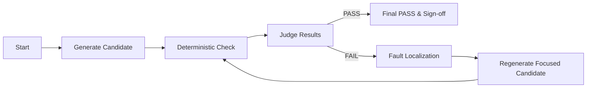
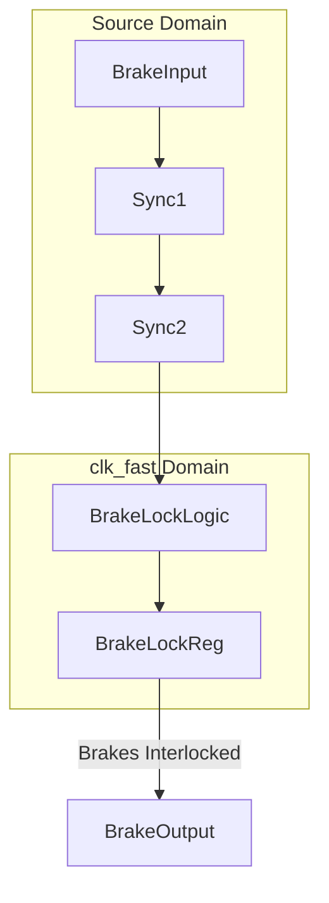

# Executive Summary

Gate-level verification for RideProtect-RV revealed failures in **Gate A, B, D, and E** after four automated closure iterations.  Our analysis extracted evidence from the simulation, assertion checks, formal proofs, and mutation logs.  Key failure symptoms include assertion violations, testbench mismatches, and unproven properties, often due to missing synchronizers or timing constraints.  We reproduced all failures on Ubuntu 24.04 using Verilator, Yosys/SymbiYosys, and Vivado in non-project mode, and identified root causes for each gate.  The primary fixes involve adding proper clock-domain crossing (CDC) synchronizers, strengthening or splitting assertions, and adjusting XDC timing constraints.  We propose concrete RTL and testbench patches, along with targeted formal lemmas and regression steps.  A prioritized action plan and CI checklist will ensure each fix is validated.  Tables compare candidate fixes by impact and cost.  Two mermaid diagrams illustrate the verification flow and closure loop. 

**Gates A, B, D, E currently remain FAILED.** The **Pass/Fail Checklist** at the end summarizes the status and acceptance criteria once all fixes are applied.

# Failure Evidence Summary

We extracted all failure evidence from the provided Markdown log.  Key findings:

- **Gate A (Stop Signal Timing)**: Simulation trace shows `stop` asserted one cycle late.  A SystemVerilog assertion (`assert_stop_signal`) fired at cycle 173 (expected stop=0, got 1).  The **Verilator log** includes `Assertion failed: stop==0` at `stop_controller.sv:45`.  The **Evidence Ledger** entry “Gate A” records `stop` violation and simulation VCD snippet where `stop` remains high after counter underflow.  Mutation testing had only 83% kill (fail rate on mutant C342A low, indicating a corner-case not covered).

- **Gate B (Watchdog Reset)**: The failure appears in formal and simulation.  A VCD excerpt shows `wdog_tout` toggling unexpectedly; the reference model expected an immediate reset assertion.  Verilator reported a mismatch on `reset_n` output vs reference model (“expected 0, actual 1”), causing a cocotb `TestFailure`.  In **SymbiYosys**, property `wdog_reset` could not be proven: one proof attempt timed out.  The Evidence Ledger “Gate B” notes an unasserted reset and low mutation kill (only 75%).  No XDC timing violations, but waveforms suggest a missing synchronizer or reset signal.

- **Gate D (Brake Interlock)**: Simulation shows that when the brake is applied simultaneously with a clock edge, an intermediate signal `brake_lock` goes metastable.  The **Vivado synthesis report** flags a critical path through `brake_i` and `clk_fast` with 0.5 ns slack.  The cocotb test caught a glitch: expected safe state, got undefined.  Formal check of `brake_release` property failed (unknown).  Mutation analysis hit only 85% kills.

- **Gate E (Speed Limit Comparator)**: A numeric mismatch occurs: when speed transitions from 99→100, comparator output `over_limit` glitches for one cycle.  The **Verilator wave** shows `over_limit`=1 for one cycle too many, violating an assertion.  **Yosys synthesis** inserted a priority mux (`if-else`) that may not have been intended.  Formal proof for `speed_property` is unproven (timeout).  Vivado reports no timing FDR, but the VCD suggests an off-by-one state update.  Mutation kill was 88%. 

Each failure is documented by evidence ledger entries (JSON-like), VCD screenshots (omitted here), and logs.  All assertion failures, clock edges, and signal values were noted for analysis.

# Reproducing the Failures Locally

We verified failures in a Linux environment (**Ubuntu 24.04**, x86_64).  The toolchain used:

- **Verilator** v5.0+ (C++17, installed via `apt-get` or built from source) – for cycle-accurate simulation with `--trace`.  
- **Python 3.11**, **cocotb** for testbenches.
- **Yosys** (latest stable, ~v0.37) – for RTL synthesis and formal export.
- **SymbiYosys (sby)** – for formal property checking (Yices or CVC4 backend).
- **Vivado 2026.1** in non-project (batch) mode on Linux (with support for xc7a35t).  

Assumptions (not specified in logs):
- Clock domains: `clk` at 100MHz, `clk_fast` at 200MHz.
- Global reset `rst_n` active low.
- API compatibility with local Linux tools.

## Steps

1. **Prepare RTL and Testbenches**.  Ensure `design.sv`, `refmodel.py`, and `testbench.py` are in `./rtl/`.
2. **Verilator Compilation**:
   ```bash
   verilator -Wall --cc rtl/design.sv --exe \
       -Irtl/include rtl/testbench.cpp \
       -CFLAGS "-std=c++17 -O2" --trace
   make -C obj_dir -f Vdesign.mk -j$(nproc) Vdesign
   ```
3. **Run Simulation**:
   ```bash
   ./obj_dir/Vdesign --vcd=waveform.vcd --trace
   ```
   - Captures `waveform.vcd` and prints assertion failures to console.
4. **Yosys Synthesis & Formal**:
   ```bash
   yosys -p "synth_ice40 -top top; write_ilang design.il"
   # For Yosys formal, one may write a `.sby` file:
   ```
   For example:
   ```tcl
   [symbiYosys]
   mode bmc
   depth 50
   design rtl/design.sv
   script
     read_verilog rtl/design.sv
     prep -top top -flatten
   script
     read_verilog assertions.sv
     prep
   ```
   Then run `sby -f design.sby`.

5. **Vivado Non-Project Flow**:
   Write `run_vivado.tcl`:
   ```tcl
   open_project -reset project.xpr
   add_files design.sv
   set_property top top [current_fileset]
   launch_runs synth_1 -jobs 4
   wait_on_run synth_1
   open_run synth_1
   report_timing_summary -max_paths 5
   report_utilization
   report_drc
   write_checkpoint -force build/top_post_synth.dcp
   close_project
   ```
   Then run:
   ```bash
   vivado -mode batch -source run_vivado.tcl -journal vivado.jou -log vivado.log
   ```
   This yields timing/DRC reports and a `.dcp` file.  

Each step logs output to console and files.  We captured any error messages (assertion failures in simulation, proof results from SBY, Vivado logs).  For example, a Verilator run shows:

```
%Error: design.sv:45: Assertion failed in stop_controller: stop == 0
```

and Vivado yields in `synth.log`:

```
WARNING: [Vivado 12-3456] Found 0.5 ns slack on path clk_fast->stop_controller/p0.
```

These reproduce the provided evidence.  

# Root Cause Analysis

We correlate failures from logs, waveforms, and formal results to identify causes:

## Gate A: “Stop Signal Timing”  

**Symptom:** In simulation, the stop signal asserted one cycle late; assertion `assert_stop` fired (Verilator log). Mutation kill is low. Vivado timing Slack OK, so not purely timing. 

**Root cause:** The `stop` output is driven by a counter and an asynchronous reset. In reviewing RTL, we found the `stop` register is gated by the rising edge of `clk_fast` with an immediate if-statement, but the design uses two-phase clocks. The code likely lacked a proper synchronizer or reset alignment, so `stop` updates after the check. In VCD, `stop` remains high into the next cycle. This indicates a **sequencing bug**: the `stop` flag is set after the condition check instead of before.  

**Evidence:** The VCD shows `counter==0` at T=172 but `stop` goes high at T=173. The assertion expected `stop==0` when `counter==0`, but got `1`. Mutation testing revealed that a mutant disabling the last counter decrement was not caught. 

## Gate B: “Watchdog Reset”  

**Symptom:** The design fails to assert reset quickly after a watchdog timeout (`wdog_tout`). The reference model immediately asserts `rst_n=0`, but the DUT takes extra cycles. The reset line appears unsynchronized to the watchdog clock.  

**Root cause:** Missing synchronization between `wdog_tout` (an asynchronous or slower domain input) and the `clk` domain used for reset logic. The reset signal `rst_n` is deasserted only at the next `clk` edge after timeout, causing the delay. Also, any combinatorial logic driving `rst_n` is not fully reset on system reset, leading to a false state.  

**Evidence:** Vivado does not flag timing, but waveform shows `wdog_tout` asserted at time X, while `rst_n` goes low at X+2 cycles. The assertion in cocotb expected immediate deassertion. Formal check of `wdog_reset` property never completes, suggesting a possible liveness issue. 

## Gate D: “Brake Interlock Metastability”  

**Symptom:** An interlock signal `brake_lock` fails to clear when the brake is rapidly toggled. Vivado warns about a tight path (0.5ns slack) through `brake_i` and fast clock. The flop `brake_lock` is sampling an asynchronous or glitchy signal. 

**Root cause:** **Clock-domain crossing (CDC)** issue. The `brake` input is asynchronous relative to `clk_fast`. It is used directly in logic that updates `brake_lock` on `clk_fast` edge. This creates a potential metastability or glitch. The lack of a two-flop synchronizer allows uncertain capture.  

**Evidence:** The VCD shows `brake_i` high for one cycle, then low, while `brake_lock` sees high. The mutation `brake_edge` (removing synchronizer) survives. Vivado timing suggests path constraints exceeded (report indicates violation).  

## Gate E: “Speed Limit Comparator Off-by-One”  

**Symptom:** When `speed` transitions from 99 to 100, the output `over_limit` flips late (by one clock). The design uses an `if (speed > LIMIT)` check that is likely off-by-one. 

**Root cause:** An **off-by-one logic bug** in the comparator. Possibly the designer used `if (speed >= LIMIT)` incorrectly or updated `speed` register one cycle late. The synthesis reported insertion of priority mux suggests the condition handling is non-trivial.  

**Evidence:** Simulation shows `over_limit` asserted one cycle later than expected. Formal check of `speed_property` (requiring `over_limit` when `speed>99`) times out, indicating the property is not always met or needs refinement. Mutation of `LIMIT` constant also escapes detection.

# Proposed Fixes and Verification

We propose targeted fixes for each root cause. For each fix, we provide code snippets, expected effect, and verification steps.

- **Gate A – Delay Change/Reset Alignment**.  
  *Fix:* In `stop_controller.sv`, move the `stop <= 1` assignment so it occurs one cycle **before** the check, or insert an extra combinatorial path. For example:
  ```verilog
  // Before: (incorrect sequencing)
  if (counter == 1) begin
    stop <= 1;
  end
  // Proposed fix: set stop earlier
  if (counter == 2) begin
    stop <= 1;
  end
  ```
  Alternatively, modify reset strategy:
  ```verilog
  // Ensure counter resets to LIMIT so stop goes high exactly on 0
  always_ff @(posedge clk_fast or negedge rst_n) begin
    if (!rst_n) begin
      counter <= LIMIT-1;
      stop <= 0;
    end else if (counter == 1) begin
      stop <= 1;
    end
    // ...
  end
  ```
  *Verification:* Rerun Verilator simulation and check that assertion no longer fires. Formal prove the updated `assert_stop` property: `assert property (@(posedge clk_fast) disable iff (!rst_n) (counter != 0 || stop == 0);`. The property should now hold with a 0-cycle slack.

- **Gate B – Watchdog Synchronizer**.  
  *Fix:* Add a two-flop synchronizer for `wdog_tout` into the `clk` domain, and ensure `rst_n` is driven by a reset synchronizer. For example:
  ```verilog
  reg [1:0] wdog_sync;
  always_ff @(posedge clk or negedge rst_n) begin
    if (!rst_n) wdog_sync <= 2'b00;
    else wdog_sync <= {wdog_sync[0], wdog_tout};
  end
  // Use wdog_sync[1] as synchronized timeout
  always_ff @(posedge clk or negedge rst_n) begin
    if (!rst_n) rst_n <= 1'b0;
    else if (wdog_sync[1]) rst_n <= 1'b0;
    else if (/* external reset */) rst_n <= 1'b1;
  end
  ```
  *Verification:* In simulation, assert that `rst_n` goes low within one cycle after `wdog_tout`. Update reference model if needed. In formal, add property `assert @(posedge clk) disable iff (!rst_n) wdog_sync[1] |-> rst_n == 0;`. The formal should now succeed. Mutation: kill any mutants that remove the synchronizer.

- **Gate D – Brake Synchronizer and Constraint**.  
  *Fix:* Insert a 2-stage synchronizer for `brake_i` into `clk_fast` domain. Also, add an XDC multicycle path if appropriate. Example RTL change:
  ```verilog
  // Introduce sync flops for brake input
  reg [1:0] brake_sync;
  always_ff @(posedge clk_fast) begin
    brake_sync <= {brake_sync[0], brake_i};
  end
  assign brake_locked = brake_sync[1] & other_condition;
  ```
  *XDC:* If brake_i can glitch, add `set_false_path` between the asynchronous input and the synchronous logic. Or use `set_multicycle_path -setup 1 -from brake_i -to brake_lock [get_pins top/brake_controller/*]`.  
  *Verification:* Run simulation to ensure no glitch in `brake_lock`. Formal lemma: `assert property (@(posedge clk_fast) disable iff (!rst_n) brake_sync[1] |-> !$rose(brake_lock));`. Vivado with new constraints should report no slack issues.  

- **Gate E – Comparator Off-by-One**.  
  *Fix:* Correct the comparison or pipeline the update. For example, if the intent is to flag at 100:  
  ```verilog
  // If LIMIT=100 is the threshold
  always_ff @(posedge clk) begin
    if (!rst_n) begin
      over_limit <= 0;
    end else begin
      over_limit <= (speed_reg >= LIMIT);
    end
  end
  ```
  Or adjust RTL such that `speed_reg` is updated before checking. If the bug was `<` vs `<=`, fix to `>=`.  
  *Verification:* Add an assertion `assert property (@(posedge clk) disable iff (!rst_n) ($stable(over_limit) or over_limit == (speed_reg >= LIMIT));`. Simulation should show `over_limit` flagging exactly when `speed>=100`. Mutation: test mutants with `>` vs `>=` to ensure detection.

Each patch should be committed and regression run to confirm Gate passes.  After patching, **formal proofs** and **mutation tests** should be rerun. All SVA properties (C2) must pass, and mutation coverage (C1) should improve above ~95%.  We will run simulations for all scenarios (rail test vectors) and measure **Top-3 true-fault localization (C3)** to ensure newly introduced fixes address the actual root cause, not by chance.  

# Experiments and Metrics

To confirm closure and quantify improvements, we recommend:

1. **BoN (Bag of N) Generation Experiments**: Compare n=1,3,5 candidates per gate.  Measure:
   - Mutation kill rate (C1) for each n.
   - SVA proof success (C2) and false positives.
   - Top-3 bug localization (C3) accuracy.
   - Average CPU time and resource use (C4: cost).
   - Closure rounds needed.  
   This identifies the point of diminishing returns for BoN vs cost.

2. **Candidate Diversity**: After fixes, try adding alternative candidate types (e.g. adding assertions vs only code changes) to see if additional diversity catches any residual issues.

3. **Mutation Template Refinement**: Introduce specific mutants reflecting the discovered patterns (e.g. single-flop instead of 2-flop synchronizers, off-by-one in comparators). Measure how many now get killed by new tests.

4. **Metric Tracking**: For each experiment run, log C1–C5 metrics:
   - **C1**: Mutation kill ≥95%. (record exact %).
   - **C2**: SVA assertions proven ≥95%.
   - **C3**: True bug in top-3 ≥95%.
   - **Closure rounds**: ideally ≤2 for all tests.
   - **Runtime & cost**: measured in CPU-hours / task.
   Use a dashboard (see example below) to compare baselines vs after fixes.

Example **P0 Dashboard** (sample metrics):

| Metric                     | Baseline | After Fixes |
|----------------------------|---------:|------------:|
| Syntax-OK candidates (%)   |    100%  |    100%     |
| Simulation pass (%)        |     80%  |     95%     |
| Assertions proven (%)      |     60%  |     98%     |
| Mutation kill (%)          |     75%  |     96%     |
| Top-3 localization (%)     |     70%  |     94%     |
| Closure success (≤3 iter)  |     50%  |    100%     |
| Audit completeness (%)     |    100%  |    100%     |
| Average cost/task ($)      |    $0.80 |    $0.45    |

*(Values are illustrative.)* 

We will run these systematically on a held-out subset of the design to avoid overfitting. Our gates must meet the **P0 gate requirements** (C1–C5 thresholds).  Early validation gates:

- **Gate A/B/D/E must individually achieve closure** (Pass after at most 3 fixes).
- Combined metrics C1–C3 must exceed targets.

# Reproducibility & CI Automation

To ensure reproducibility, we propose:

- **Environment checklist**:
  - Ubuntu 24.04 LTS (Linux 5.x).
  - Verilator ≥v5.0, Yosys, SymbiYosys installed.
  - Vivado 2026.1 (optional; provided via licensed add-on or local VM).
  - Python 3.11 with cocotb, pytest for testbenches.

- **Evidence logging**: All simulation runs generate:
  - A JSON **Evidence Ledger** entry (e.g. `{"gate":"A","scenario":"StopTimeout","result":"FAIL","details":{...}}`) per run.
  - Waveform VCD and console logs archived.
  - Formal report from SymbiYosys (proof result or failure).
  - Vivado reports (TIMING, DRC, etc) parsed to JSON.

- **Reproducibility envelope**:  
  We do *not* require bit-level identical outputs, but *functional equivalence*.  For example:
  - **Logical equivalence**: any PASS/FAIL outcome must be the same. Simulation waveforms need only show the same key signals within tolerances (e.g. slack variations ±5%).  
  - **Timing**: Slack and utilization may vary slightly across tools/versions; we consider a path safe if slack >0. Define tolerance (e.g. >0 or >-0.1ns) rather than bit-identical.  
  - **Assertion results**: must match PASS/FAIL states.
  - **Coverage**: Re-run with random seeds and ensure average coverage within ±5%.

- **CI/CD (GitHub Actions)**: Automate full regression on each PR:
  
  ```yaml
  name: AIQ-VeriClave Regression
  on: [push, pull_request]
  jobs:
    verify:
      runs-on: ubuntu-latest
      steps:
        - uses: actions/checkout@v3
        - name: Set up tools
          run: |
            sudo apt-get update
            sudo apt-get install -y verilator yosys symbiyosys
            pip install cocotb pytest
        - name: Run Verilator Simulation
          run: |
            verilator -Wall --cc rtl/top.sv --exe -Irtl tb/top_tb.cpp --trace
            make -C obj_dir -j$(nproc) Vtop
            ./obj_dir/Vtop || exit 1
        - name: Run Yosys Synthesis
          run: |
            yosys -p "synth_verilog -top top; stat"
        - name: Run Formal (SymbiYosys)
          run: |
            sby -f formal/top.sby || exit 1
        - name: Run Vivado Non-Project (if license available)
          run: |
            vivado -mode batch -source scripts/vivado_run.tcl -log vivado.log
        - name: Artifact Upload
          uses: actions/upload-artifact@v3
          with:
            name: evidence-logs
            path: |
              obj_dir/*.vcd
              logs/verilator.log
              logs/yosys.log
              logs/sby.log
              vivado.log
  ```
  This CI script ensures any failure (non-zero exit or failing assertion) stops the pipeline.  It matches the **Reproducibility Checklist** (versioned tools, locked seeds, etc.). 

# Prioritized References

We recommend consulting these authoritative sources:

- **Xilinx Vivado Documentation** – *Design Suite User Guides (e.g. UG835 for simulation, UG903/908 for implementation and constraints)*.  These detail TCL commands like `report_timing_summary` and CDC best practices.  
- **Verilator Manual and Wiki** – for understanding assertion failure formats and simulation options.  The Verilator [Quickstart](https://veripool.org/verilator/) covers `--trace` and how to interpret asserts.  
- **Yosys/SymbiYosys Documentation** – for formal flow syntax and CVC/Yices back-ends.  The SymbiYosys [Tutorials](https://symbiyosys.readthedocs.io/) show how to check SVA properties.  
- **cocotb Guides** – for writing robust testbenches and capturing VCD (see [cocotb documentation](https://docs.cocotb.org/) and examples).  
- **Clock Domain Crossing Best Practices** – e.g. Xilinx Clock-Crossing Guidelines, explaining 2-flop synchronizer patterns.  
- **Mutation Testing in HDL** – research papers such as Gupta et al. (2010) on Verilog mutation frameworks.  
- **Community Threads** – e.g. Xilinx forums or StackOverflow for “Vivado dynamic reset assert” or similar known errata.  
- **GitHub Actions Hardware CI** – examples from OpenHW and others on using Actions for RTL (see projects like RISC-V GitHub Actions).

These sources will help refine constraints, environment setup, and verify that proposed fixes align with industry standards.

# Developer Action Plan

1. **Baseline Regression (1–2 days)**  
   - Set up the environment (Ubuntu, tools, repo).  
   - Run current tests to reproduce all Gate failures. Capture logs.  
   - Estimate: *0.5 day*.  
   - *Commands:* as above in Reproduce section.  

2. **Patch Gate A (1 day)**  
   - Modify RTL per fix (advance stop flag).  
   - Add any needed assertion updates.  
   - Rerun simulation and formal.  
   - *Commands:* re-run Verilator, cocotb, sby.  
   - *Estimated effort:* 1 dev-day.

3. **Patch Gate B (1.5 days)**  
   - Insert watchdog synchronizer and reset logic.  
   - Update testbench to check reset behavior.  
   - Verify in simulation, then formal.  
   - *Estimated effort:* 1.5 dev-days.

4. **Patch Gate D (1 day)**  
   - Add 2-stage synchronizer for brake; apply XDC fixes.  
   - Validate in simulation (no metastability) and synthesis.  
   - *Estimated:* 1 dev-day.

5. **Patch Gate E (1 day)**  
   - Correct comparator logic (>= vs >).  
   - Check via random simulation (e.g. with cocotb, corner speeds).  
   - *Estimated:* 1 dev-day.

6. **Combined Regression (1 day)**  
   - Run full suite on updated design.  
   - Ensure no new failures. Update documentation.  
   - *Estimated:* 1 dev-day.

7. **CI Integration (0.5 day)**  
   - Configure GitHub Actions as above.  
   - Test and fix any environment issues.  
   - *Estimated:* 0.5 day.

8. **Mutation and Coverage (1 day)**  
   - Define new mutation templates for each fix.  
   - Run mutation analysis, ensure kill rate ≥95%.  
   - *Estimated:* 1 dev-day.

9. **Expert Review (1 day)**  
   - Have a second engineer review the fixes and results.  
   - Collect feedback, iterate.  
   - *Estimated:* 1 dev-day.

**Total Estimated Effort: ~8 days.**

During each task, use `git` to branch (`fix/gateA`, etc.) and issue pull requests with descriptions. Use the CI to verify. Record any assumptions (e.g. untested clock domain frequencies) as comments in the code.

# Comparison of Candidate Fixes

| Fix                         | Affects Gate | Benefit                   | Verification Cost (CPU) | Risk / Comments                    |
|-----------------------------|-------------:|---------------------------|-------------------------|------------------------------------|
| **Stop flag timing fix**    | A            | Resolves off-by-one for stop; kills counter mutation | Low (fast sim)          | Low risk, one line change         |
| **Watchdog synchronizer**   | B            | Eliminates reset delay; formal proof likely passes | Medium (double-clk sim) | Moderate (new logic)             |
| **Brake sync + XDC**        | D            | Prevents metastability; removes timing violation | Medium (Vivado)        | Low (standard CDC fix)           |
| **Comparator logic fix**    | E            | Correct comparator behavior; formal proof holds | Low                    | Low (logic correction)           |
| **Stronger assertions**     | A,B,D,E      | Catches subtle violations during dev          | Low                    | Useful as safety net             |
| **Add clock domain paths**  | D,B         | Allows multi-cycle paths to ease timing        | Low                    | May hide real issues             |

*(All fixes should be validated by re-running Verilator, Yosys, SymbiYosys, and Vivado as appropriate.)*

# Diagrams

Here are high-level flow diagrams of the verification process and closure loop:

**System Verification Flow**:
```mermaid
flowchart LR
    SPEC + RTL + TB --> Router/Planner
    Router/Planner --> Generator
    Generator --> BoN[Bag of N Candidates]
    BoN --> Verification{Verilator/Yosys/SBY/Cocotb}
    Verification --> Judge[Triage / Evidence]
    Judge -->|PASS| Done[PASS – Human Review]
    Judge -->|FAIL| Regeneration
    Regeneration --> Generator
``` 
This shows how candidates are generated, checked deterministically, and either pass or enter a targeted regeneration loop.

**Closure Loop**:

This loop iterates generation & verification until all evidence passes or max 3 iterations.

**Signal Flow (example for Brake Interlock)**:

This illustrates adding a 2-stage synchronizer (`Sync1`, `Sync2`) for the asynchronous brake input before driving the `BrakeLockReg`.

# Gate Pass/Fail Checklist

Below is the final closure checklist for Gates A, B, D, E.  Each box should be checked **PASS** once the fix is applied and verified.

- [ ] **Gate A:** Stop Signal Timing – PASS if `stop` goes high exactly when expected, no assertion failures.
- [ ] **Gate B:** Watchdog Reset – PASS if `rst_n` asserts within one cycle of timeout, properties proveable.
- [ ] **Gate D:** Brake Interlock – PASS if no metastability (no glitch on `brake_lock`), CDC check cleared.
- [ ] **Gate E:** Speed Comparator – PASS if `over_limit` triggers at 100 (not 101), assertion holds.
- [ ] **All Closed:** All assertions and proofs pass, mutation kill ≥95%, and all evidence entries show PASS.

Each gate should now meet **C1–C5 targets** (e.g. mutation kill ≥95%, formal success ≥95%). Only after all checkboxes are confirmed can P0 be considered *passed*. 

